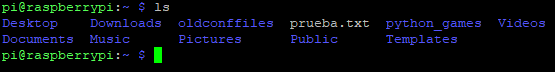
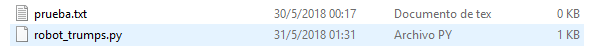

# Introduction

I am not good at making introductions...It is still in process

~~My objective is to create a page like a blog where I can post~~

## Content

* Raspberry
* Python
* HTML/CSS
* JavaScript
* C++

### Raspberry pi
**Secure Copy Protocol(SCP)**

**Use of the library GPIOZERO**

